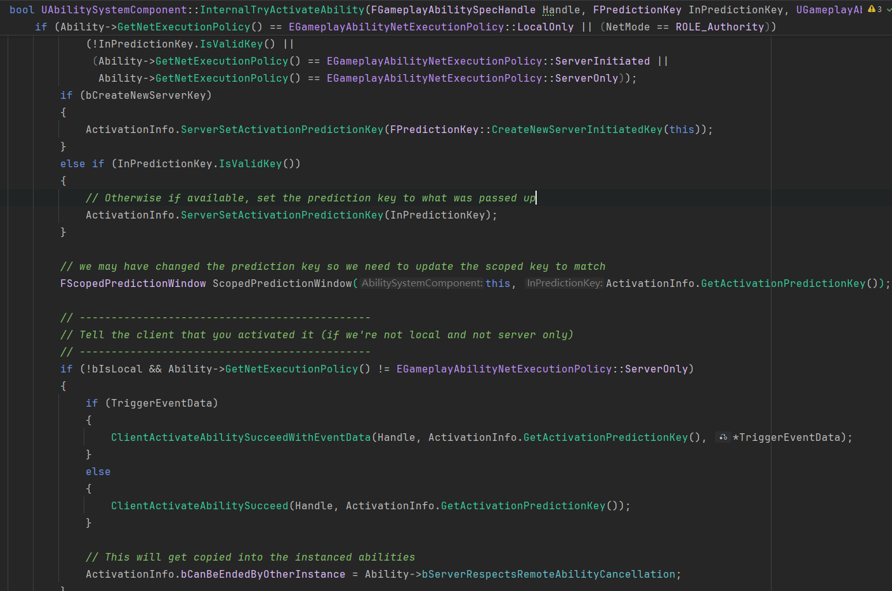

## GAS预测
***
### GA预测
首先，什么样的GameplayAbility可以预测？GA有一个字段NetExecutionPolicy，表示它的网络执行方式:
```cpp
UENUM(BlueprintType)
namespace EGameplayAbilityNetExecutionPolicy
{
	/** Where does an ability execute on the network. Does a client "ask and predict", "ask and wait", "don't ask (just do it)" */
	enum Type : int
	{
		// Part of this ability runs predictively on the local client if there is one
		LocalPredicted		UMETA(DisplayName = "Local Predicted"),

		// This ability will only run on the client or server that has local control
		LocalOnly			UMETA(DisplayName = "Local Only"),

		// This ability is initiated by the server, but will also run on the local client if one exists
		ServerInitiated		UMETA(DisplayName = "Server Initiated"),

		// This ability will only run on the server
		ServerOnly			UMETA(DisplayName = "Server Only"),
	};
}
```
只有LocalPredicted的Ability支持预测

我们应当让所有和手感挂钩的GA，比如冲刺、跳跃、技能激活都可被预测

#### GA预测流程：
1. 客户端通过`TryActivateAbility`尝试激活技能，通过一系列判断后，进入`InternalTryActivateAbility`

若GA为LocalPredicted，则创建一个预测窗口`FScopedPredictionWindow`
```cpp
// This execution is now officially EGameplayAbilityActivationMode:Predicting and has a PredictionKey
FScopedPredictionWindow ScopedPredictionWindow(this, true);
```
创建预测窗口将角色的ASC传入，主要做了两件事:
1. 将预测窗口的`RestoreKey`设置为ASC当前预测窗口的Key，当这一个栈帧退栈后，会把ASC的当前预测Key恢复
2. 生成一个新的Key，并查看当前ASC的PredictKey的CurrentKey是否大于0。如果大于0，说明当前函数栈帧嵌套在外层的预测窗口中，当前GA是由上一个GA触发的，比如GA1->GA2，这种情况下，若GA1预测失败了，GA2也要跟着回滚。这种情况，我们需要把新的Key的Confirm和Reject，绑定在上一个Key的回调上，实现这个操作
3. 当函数执行完毕，触发预测窗口的析构函数，回退ASC的Key为RestoreKey

创建完毕预测窗口后，客户端将当前PredictKey发往服务器，执行`CallServerTryActivateAbility`函数

服务器拿到PredictKey后，使用PredictKey创建预测窗口，并执行和客户端一样的流程. 当任何一步操作失败，就会执行`ClientActivateAbilityFailed`通知客户端预测失败了. 预测失败会携带两个参数Handle和当前PredictKey:
- 通过PredictKey，找到客户端对应的Key，广播其身上的被拒绝事件，回滚操作
- 通过GA的Handle，找到客户端上对应的Handle实例，将其激活信息标注为被拒绝，并执行EndAbility
回滚操作通过绑定在PredictKey上的委托激活，比如播放蒙太奇的回滚操作就是立即停止蒙太奇

#### GA中延迟Task的预测
由于预测窗口只在一帧下生效，对于GA中激活的延迟Task，需要手动构建预测窗口来完成.

   


