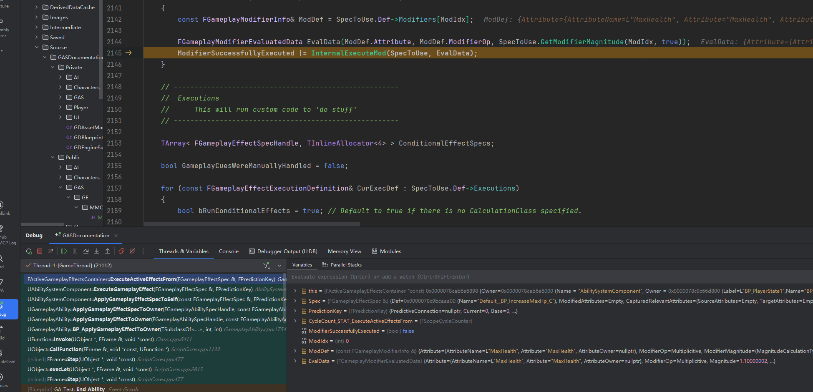

## Modifier应用
***
### Modifier 应用流程
**Modifier可以修改Attribute并且是唯一可以预测性修改Attribute的方法. **
- 每个Modifier包含了一个**操作类型**，表示将对属性BaseValue执行的操作.
- 每个Modifier会根据其类型，通过计算生成一个浮点数，并根据操作类型来决定浮点数的作用方式
Modifier可分为四种类型:
1. Scalable Float: 一般是硬编码的固定值，可受到等级修正.
2. Attribute Based: 数值由Source或者Target身上的属性来决定，可通过SnapShot参数来指定，究竟是GE被施加上的时候捕获，还是GE应用的时候捕获. 此外可以通过Pre和Post系数来修正
3. Custom Calculation Class: 自定义数值的计算方式
4. Set By Caller: 通过GE的创建者动态施加. 创建者可以编辑GESpec上的一个Map，Modifier可以用GameplayTag或者FName的方式去索引Map上的数值

### Instant类型GE执行Modifier
调用栈：

当判断GE是一个即刻触发类型的效果，并且能够被激活后，会执行到`UAbilitySystemComponent::ExecuteGameplayEffect`来实际运行这个效果. ASC会通过ActiveGameplayEffects去实际执行这个效果:
```cpp
void UAbilitySystemComponent::ExecuteGameplayEffect(FGameplayEffectSpec &Spec, FPredictionKey PredictionKey)
{
#if WITH_SERVER_CODE
	SCOPE_CYCLE_COUNTER(STAT_AbilitySystemComp_ExecuteGameplayEffect);
#endif

	//...

	ActiveGameplayEffects.ExecuteActiveEffectsFrom(Spec, PredictionKey);
}
```
`ExecuteActiveEffectsFrom` 是Instant类型GE效果应用Modifier和Executions的核心，本章只关注Modifier的应用:
1. 执行CalculateModifierMagnitudes，预计算Modifier所要施加的数值
2. 遍历每一个Modifer，调用`InternalExecuteMod`来走内部应用逻辑
3. 执行`ApplyModToAttribute`，根据操作类型，将Modifier的计算值施加到AttributeSet中
对于Instant类型的GE，属性修正没有乘区的概念，加和乘都是应用在属性的当前值上的
```cpp
float FAggregator::StaticExecModOnBaseValue(float BaseValue, TEnumAsByte<EGameplayModOp::Type> ModifierOp, float EvaluatedMagnitude)
{
	switch (ModifierOp)
	{
		case EGameplayModOp::Override:
		{
			BaseValue = EvaluatedMagnitude;
			break;
		}
		case EGameplayModOp::Additive:
		{
			BaseValue += EvaluatedMagnitude;
			break;
		}
		case EGameplayModOp::Multiplicitive:
		{
			BaseValue *= EvaluatedMagnitude;
			break;
		}
		case EGameplayModOp::Division:
		{
			if (FMath::IsNearlyZero(EvaluatedMagnitude) == false)
			{
				BaseValue /= EvaluatedMagnitude;
			}
			break;
		}
	}

	return BaseValue;
}
```

我们项目中基本只实现了Scalable Float、简单的Attribute Based和简单的SetByCaller. 而GAS中，很多数值都是通过MagnitudeCalculationType来获得的，不仅方便而且可以复用:
```cpp
/** Enumeration outlining the possible gameplay effect magnitude calculation policies. */
UENUM()
enum class EGameplayEffectMagnitudeCalculation : uint8
{
	/** Use a simple, scalable float for the calculation. */
	ScalableFloat,
	/** Perform a calculation based upon an attribute. */
	AttributeBased,
	/** Perform a custom calculation, capable of capturing and acting on multiple attributes, in either BP or native. */
	CustomCalculationClass,	
	/** This magnitude will be set explicitly by the code/blueprint that creates the spec. */
	SetByCaller,
};
```

### Duration类型应用Modifier
Duration类型GE分为两种：Period 为0的非Dot型GE，和根据Period时间触发的Dot型GE，二者触发方式也有所区别.

GE被添加后，在GE进行一系列Tag判断后，进入`FActiveGameplayEffect::CheckOngoingTagRequirements`函数，如果GE需要激活，则进入`AddActiveGameplayEffectGrantedTagsAndModifiers`来生效这个GE带来的Modifier和Tag；如果GE失效，则调用`RemoveActiveGameplayEffectGrantedTagsAndModifiers`

在`AddActiveGameplayEffectGrantedTagsAndModifiers`内部，会进行一次Period的判断，来决定是直接生效还是注册定时器:
```cpp
// Register this ActiveGameplayEffects modifiers with our Attribute Aggregators
	if (Effect.Spec.GetPeriod() <= UGameplayEffect::NO_PERIOD)
	{
		for (int32 ModIdx = 0; ModIdx < Effect.Spec.Modifiers.Num(); ++ModIdx)
		{
			// ...

			FAggregator* Aggregator = FindOrCreateAttributeAggregator(Effect.Spec.Def->Modifiers[ModIdx].Attribute).Get();
			if (ensure(Aggregator))
			{
				Aggregator->AddAggregatorMod(EvaluatedMagnitude, ModInfo.ModifierOp, ModInfo.EvaluationChannelSettings.GetEvaluationChannel(), &ModInfo.SourceTags, &ModInfo.TargetTags, Effect.PredictionKey.WasLocallyGenerated(), Effect.Handle);
			}
		}
	}
	else
	{
		if (Effect.Spec.Def->PeriodicInhibitionPolicy != EGameplayEffectPeriodInhibitionRemovedPolicy::NeverReset && Owner && Owner->IsOwnerActorAuthoritative())
		{
			// ...
			TimerManager.SetTimer(Effect.PeriodHandle, Delegate, Effect.Spec.GetPeriod(), true);
		}
	}
```

值得注意的是对于Modifier的处理，Duration使用FAggregator属性聚合器，将一个GE施加的Modifier聚合在一起，并将其标为Dirty. 遍历完所有Modifier后，触发一个Aggregator的更新.

而对于Period大于0的GE，在注册定时器后，会定期执行`ExecuteActiveEffectsFrom`，那就和上面Instant类型的GE一样了

