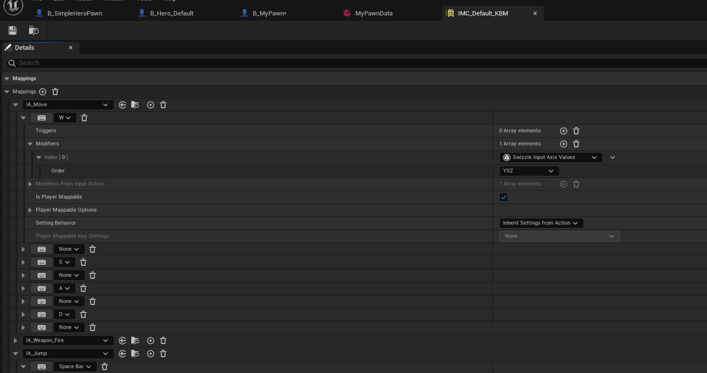
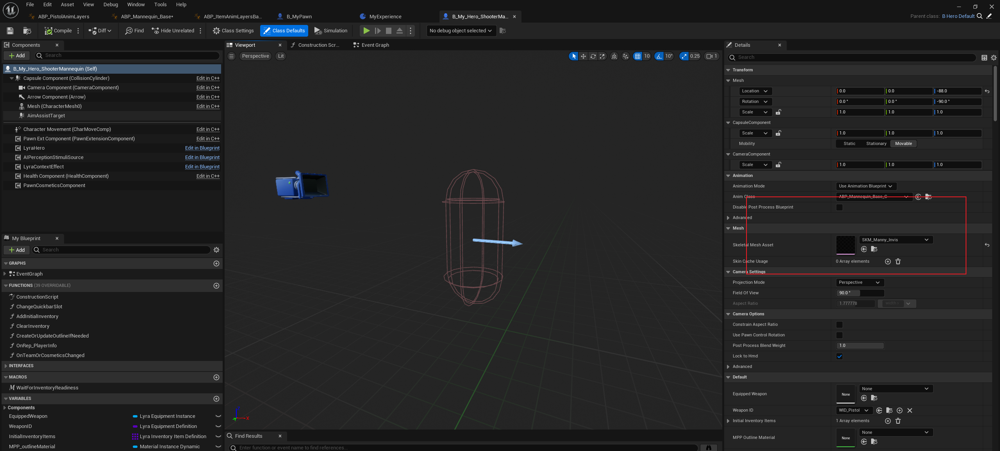
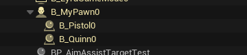
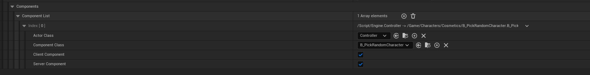
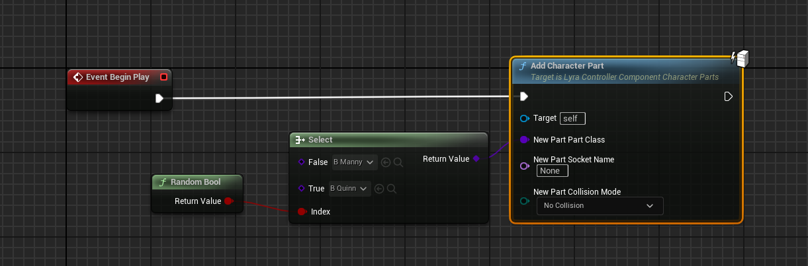
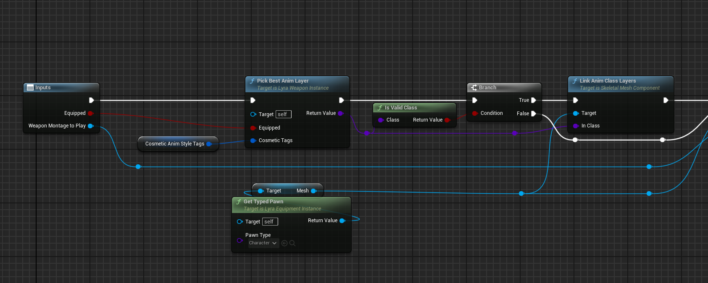

# Lyra 初始化流程
***

## 关卡初始化流程

#### Experience的初始化
首先进入一个关卡，以L_ShooterGym为例
Lyra使用了GameExperience的概念用来配置一场游戏的各种玩法，在概念上与GameMode类似，但更偏向于策划进行灵活的资产配置：

进入关卡后默认的Pawn对象类在这里可以设置。

Experience类的选择是在GameMode初始化InitGame时决定的，GameMode会按照优先级从多个配置处读取ExperienceId：
```cpp
void ALyraGameMode::HandleMatchAssignmentIfNotExpectingOne()
{
	FPrimaryAssetId ExperienceId;
	FString ExperienceIdSource;

	// Precedence order (highest wins)
	//  - Matchmaking assignment (if present)
	//  - URL Options override
	//  - Developer Settings (PIE only)
	//  - Command Line override
	//  - World Settings
	//  - Dedicated server
	//  - Default experience

	UWorld* World = GetWorld();

	if (!ExperienceId.IsValid() && UGameplayStatics::HasOption(OptionsString, TEXT("Experience")))
    // ...
```


## 角色初始化流程
Lyra的角色（小蓝人）的继承链为:B_Hero_ShooterMannequin -> B_HeroDefault -> CharacterDefault -> LyraCharacter (C++)
其中从B_HeroDefault开始，加入了LyraHero组件，这个控件会处理到角色输入这一层。 而B_Hero_ShooterMannequin则是实际的游戏对象，包括了输入、动画、能力等。


### 角色输入
Lyra使用EnhancedInputSystem来处理玩家的输入逻辑，可以认为是UE4InputSystem的强化版。简单来说EnhancedInputSystem将输入配置拆为三个粒度的模块:
- InputAction: 和UE4的Input系统一致，将角色的输入抽象为具体的事件，和输入解耦。 比如移动、跳跃、射击都属于InputAction
- InputMappingContext(IMC)：用于将InputAction和控制器的键位映射起来，还能够配置每个键位具体的映射方式，比如轴映射、按下/释放、长按等，功能强大

- PlayerMappingInputConfig(PMI)：PMI是IMC的更进一层封装，也是实际注册输入时，使用的对象。它可以包含多个IMC，通过调用`UEnhancedInputLocalPlayerSubsystem->AddPlayerMappableConfig()`动态为操控角色注册一套键位

简单来说，让角色能够处理玩家输入，需要做两件事：
1. 为角色绑定一套PMI，通过`UEnhancedInputLocalPlayerSubsystem->AddPlayerMappableConfig()`
```cpp
	if (const ULyraInputConfig* InputConfig = PawnData->InputConfig)
	{
		// Register any default input configs with the settings so that they will be applied to the player during AddInputMappings

		// DefaultInputConfigs是记录在HeroComponent的默认键位
		for (const FMappableConfigPair& Pair : DefaultInputConfigs)
		{
			if (Pair.bShouldActivateAutomatically && Pair.CanBeActivated())
			{
				FModifyContextOptions Options = {};
				Options.bIgnoreAllPressedKeysUntilRelease = false;
				// Actually add the config to the local player							
				Subsystem->AddPlayerMappableConfig(Pair.Config.LoadSynchronous(), Options);	
			}
		}
```

2. 通过`BindAction`，将输入产生的InputAction与实际逻辑绑定起来
```cpp
	LyraIC->BindNativeAction(InputConfig, LyraGameplayTags::InputTag_Move, ETriggerEvent::Triggered, this, &ThisClass::Input_Move, /*bLogIfNotFound=*/ false);
	LyraIC->BindNativeAction(InputConfig, LyraGameplayTags::InputTag_Look_Mouse, ETriggerEvent::Triggered, this, &ThisClass::Input_LookMouse, /*bLogIfNotFound=*/ false);
	LyraIC->BindNativeAction(InputConfig, LyraGameplayTags::InputTag_Look_Stick, ETriggerEvent::Triggered, this, &ThisClass::Input_LookStick, /*bLogIfNotFound=*/ false);
	LyraIC->BindNativeAction(InputConfig, LyraGameplayTags::InputTag_Crouch, ETriggerEvent::Triggered, this, &ThisClass::Input_Crouch, /*bLogIfNotFound=*/ false);
	LyraIC->BindNativeAction(InputConfig, LyraGameplayTags::InputTag_AutoRun, ETriggerEvent::Triggered, this, &ThisClass::Input_AutoRun, /*bLogIfNotFound=*/ false);
```

### 让角色动起来
查看Lyra的主角B_Hero_ShooterMannequin可以发现，它的Mesh是不可见的。

这是因为Lyra将角色与角色对应的Mesh做了解耦，角色的动画状态机只跑逻辑，而输出的Pose会通过一个CopyPose的方式，复制给角色下方挂接的B_Manny或B_Quinn。 具体为什么这么做在后面动画部分可以更详细的分析。

所以为了让角色动起来，我们需要在角色初始化后创建B_Manny，这是通过角色身上的PawnCosmeticsComponent组件来实现的。
首先，在Experience蓝图中配置了随机选择主控角色Mesh的逻辑：


实际是访问了Controller身上的`LyraControllerComponentCharacterParts`组件，这个组件在C++中通过角色身上的`ULyraPawnComponent_CharacterParts`组件来为角色身上加Mesh，在这里将B_Manny或B_Quinn加上去了

```cpp
ULyraPawnComponent_CharacterParts* ULyraControllerComponent_CharacterParts::GetPawnCustomizer() const
{
	if (APawn* ControlledPawn = GetPawn<APawn>())
	{
		return ControlledPawn->FindComponentByClass<ULyraPawnComponent_CharacterParts>();
	}
	return nullptr;
}

void ULyraControllerComponent_CharacterParts::AddCharacterPartInternal(const FLyraCharacterPart& NewPart, ECharacterPartSource Source)
{
	FLyraControllerCharacterPartEntry& NewEntry = CharacterParts.AddDefaulted_GetRef();
	NewEntry.Part = NewPart;
	NewEntry.Source = Source;

	if (ULyraPawnComponent_CharacterParts* PawnCustomizer = GetPawnCustomizer())
	{
		if (NewEntry.Source != ECharacterPartSource::NaturalSuppressedViaCheat)
		{
			NewEntry.Handle = PawnCustomizer->AddCharacterPart(NewPart);
		}
	}

}
```

但此时角色依然没有动画，因为Lyra中角色的主状态机只有逻辑，没有具体的动画资产。 实际的动画资产要通过将装备（比如手枪）装备到角色身上时，调用武器类上的ActivateAnimLayerAndPlayPairedAnim来实现

可以看到实际需要调用的是LinkAnimClassLayers，这一步会将武器包含的动画蓝图连接角色动画蓝图上，至此角色动画蓝图才能够正常运作。