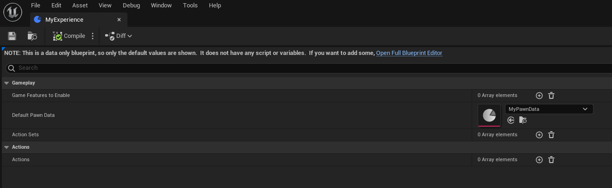

# Lyra 初始化流程
***

## 关卡初始化流程

#### Experience的初始化
首先进入一个关卡，以L_ShooterGym为例
Lyra使用了GameExperience的概念用来配置一场游戏的各种玩法，在概念上与GameMode类似，但更偏向于策划进行灵活的资产配置：

进入关卡后默认的Pawn对象类在这里可以设置。

Experience类的选择是在GameMode初始化InitGame时决定的，GameMode会按照优先级从多个配置处读取ExperienceId：
```cpp
void ALyraGameMode::HandleMatchAssignmentIfNotExpectingOne()
{
	FPrimaryAssetId ExperienceId;
	FString ExperienceIdSource;

	// Precedence order (highest wins)
	//  - Matchmaking assignment (if present)
	//  - URL Options override
	//  - Developer Settings (PIE only)
	//  - Command Line override
	//  - World Settings
	//  - Dedicated server
	//  - Default experience

	UWorld* World = GetWorld();

	if (!ExperienceId.IsValid() && UGameplayStatics::HasOption(OptionsString, TEXT("Experience")))
    // ...
```


## 角色初始化流程
Lyra的角色（小蓝人）的继承链为:B_Hero_ShooterMannequin -> B_HeroDefault -> CharacterDefault -> LyraCharacter (C++)
其中从B_HeroDefault开始，加入了LyraHero组件，这个控件会处理到角色输入这一层。 而B_Hero_ShooterMannequin则是实际的游戏对象，包括了输入、动画、能力等。


