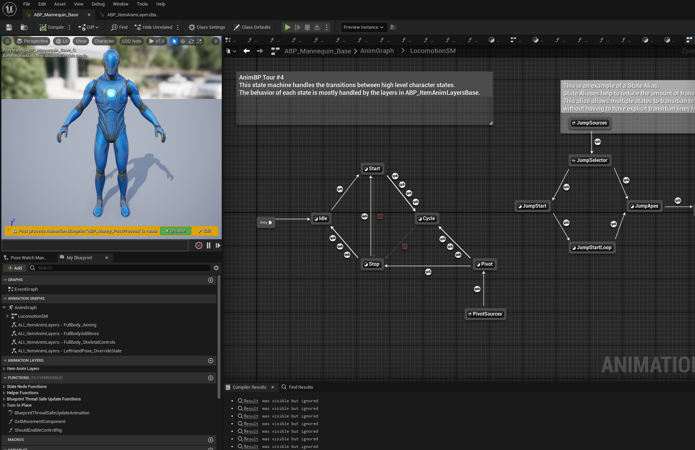
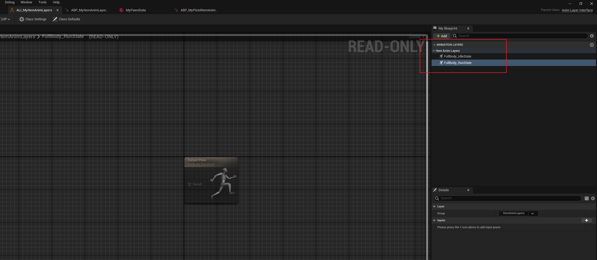
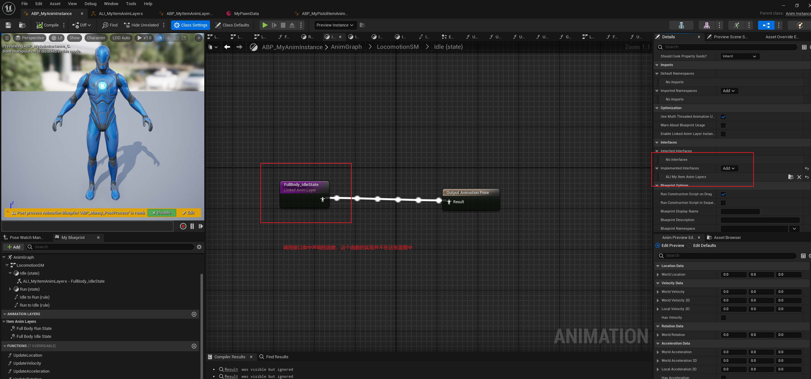
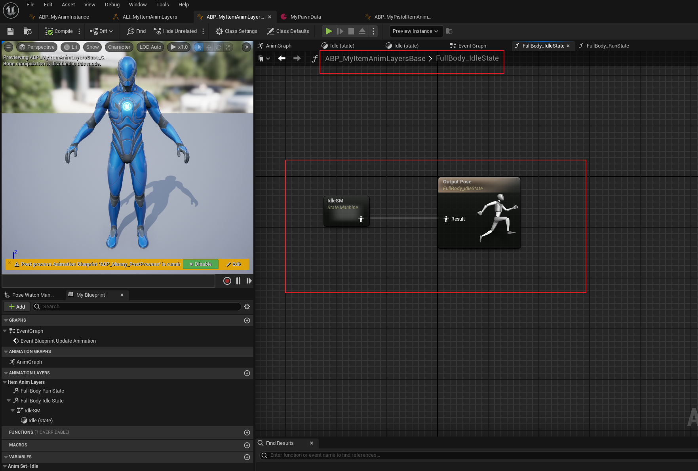
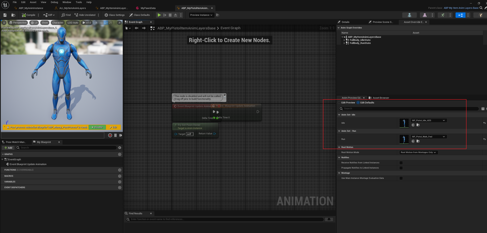
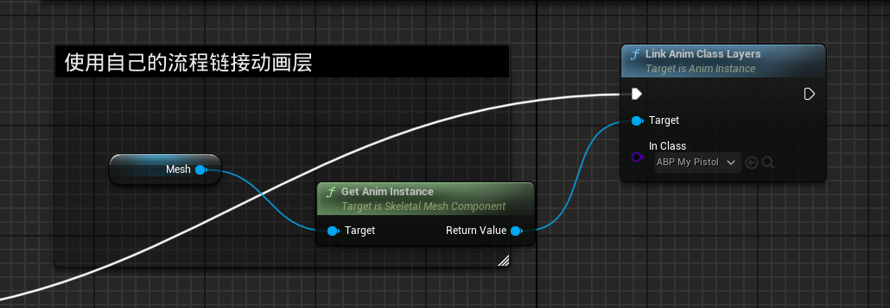

# Lyra动画基础框架
***

## 参考文档: 
[UE5 Lyra项目学习（五） 模块化动画系统](https://zhuanlan.zhihu.com/p/599610314)

[Lyra动画系统拆解（框架篇）](https://zhuanlan.zhihu.com/p/628247619)

## Lyra的动画组织
Lyra使用了动画层接口实现了动画状态机与动画状态机内部实现的解耦。 另外，Lyra使用**动画蓝图链接**的技术，支持在运行时将角色所必需的动画资产链接到动画状态机上，这使得动画状态机运行时不需要加载与该角色无关的动画资产。

Lyra将角色的动画蓝图拆为**ABP_ManneQuinn_Base**和**ABP_ItemAnimLayersBase**，这两者都继承了动画蓝图接口类**ALI_ItemAnimLayers**
其中：**ABP_ManneQuinn_Base** 主要负责管理动画的状态转移，并且负责根据角色状态更新动画所需的数据：

而**ABP_ItemAnimLayersBase**则主要负责实现ABP_ManneQuinn_Base中定义的每一个状态的具体逻辑，比如行走状态的实现，起步、停步的实现，但它本身并不会和具体的动画资产相绑定。

那么这两张动画蓝图是如何通信的呢？靠ALI_ItemAnimLayers这个动画蓝图接口实现。 两张蓝图都继承了这个接口类，可以在这张接口类中定义“动画蓝图的接口函数”。 当ABP_ItemAnimLayersBase通过动画蓝图链接绑定到ABP_ManneQuinn_Base之后，就可以通过调用接口类函数来执行到ABP_ItemAnimLayersBase中的具体实现了。具体流程如下：

1. 建立动画蓝图接口类ALI_ItemAnimLayers, 声明相关接口函数：
   

2. 角色动画蓝图ABP_ManneQuinn_Base继承该接口类，并调用接口函数：

3. 在ABP_ItemAnimLayersBase中，继承该接口类，实现接口函数的具体逻辑：

注意，在这张蓝图中只实现状态的逻辑，而不会引用到具体的资产，这里凡是用到动画序列的地方，都用变量替代了

4. 实际角色绑定的将会是ABP_ItemAnimLayersBase的子类蓝图，这个目的是将动画逻辑与动画资产解耦。 比如角色拿着手枪和拿着步枪，可能仅仅是动画资产上有区别，而动画逻辑是一样的。所以我们做了这一步解耦后，就可以轻松做出手枪和步枪两套资产。

5. 在角色蓝图中，调用LinkAnimClassLayers，将动画层蓝图链接到角色动画蓝图中，实现了动画状态与动画逻辑的绑定

这个函数会做类似遍历角色状态机上所有调用了同一个动画接口的位置，用动画层蓝图的逻辑去做替换。

## 总结
Lyra使用了动画层接口，配合动画蓝图链接的技术，实现了动画状态与动画状态逻辑的解耦。 另外通过子类继承的方式，实现了动画逻辑与动画资产的解耦。