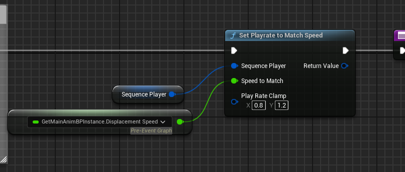

# Lyra基础移动
***
Lyra将基础移动分为四个状态：Idle(静止)，Start(起步)，Cycle(移动), Stop(停步)

## 必要的移动信息
在处理动画状态之前，我们最好先收集角色移动的一些相关信息，如速度、加速度、位移、旋转等，在后续各种计算中都会用到。可以在`BlueprintThreadSafeUpdateAnimation`阶段，做角色移动数据的更新。

这里以世界速度和局部速度来举例子，世界速度可以直接拿到，而局部速度要通过世界速度和世界旋转算出：

另外，Lyra通过SelectCardinalDirectionFromAngle将局部速度的方向分为了前后左右四个大方向，用于后面选择动画序列。 四个方向总体以y = x 和 y = -x 两条直线划分。

## Idle状态
最简单的状态，决定当角色无任何操作时输出的动画。目前只需要一个Idle动画循环播放即可：

## Cycle状态
Cycle状态需要输出角色的移动动画，这里主要需要考虑：
1. 用有限的资产（四向跑步），去拟合出360度的移动动画
2. 步幅需要和角色的实际运动速度相匹配，不然角色会出现滑步问题

对于问题1，Lyra给出的方案是使用胯部扭曲节点。简单说，我们需要做到的是角色上半身始终朝向视角方向，而下半身朝向速度方向。所以我们需要在角色播放骨骼动画之后，把角色Root扭转一个角度，让其朝向我们所需的速度方向。然后再将角色上半身反转一个角度，使得上半身实际还是朝着正前方。
具体可以参考：
[UE4 Locomotion 朝向适配(Orientation Warping)](https://zhuanlan.zhihu.com/p/363366640)

对于问题2，Lyra使用了两个节点来解决：
1. 使用`SetPlayrateToMatchSpeed`节点，控制动画的播放速率，来提升或降低角色迈腿的速度，一定程度上缓解滑步问题

这个节点的作用实际上是将角色Cycle动画根运动的速度和实际速度做一个比值，实际播放速率 = 1.0 * (实际移动速度 / 根运动位移速度)，这里还加了一个clamp，防止结果太鬼畜

2. 使用跨步扭曲节点，让角色每次迈步的距离与实际移动距离相匹配。 需要传入当前移动速度，IKFoot骨骼和Pelvis骨骼：

## Start状态
Start状态是角色从Idle到Cycle的中间过渡状态，和Cycle类似也需要实现多向移动和步幅匹配，所以也使用到了朝向扭曲和跨步扭曲：

与Cycle状态有所不同的是，Start是一个一次性播完的动画，而且必定是从头开始播，我们不能直接使用`SetPlayrateToMatchSpeed`来控制动画播放速率，而是要根据玩家的位移，具体定位到应该播放Start动画的哪一帧。 Lyra使用了`AdvanceTimeByDistanceMatching`节点来完成这个事情：

参数给入已经移动的距离，给出一个动画资产的根运动位移曲线，推进SequenceEvaluator到指定的位置。 这个节点要求动画资产一定是根运动的，不然拿不到动画的位移信息，也提取不出位移曲线。

## Stop状态
和Start状态类似，但不使用`AdvanceTimeByDistanceMatching`节点来做步幅匹配，因为停步动画和起步动画有一个关键的区别：起步动画必须从头开始播，且不需要播完即可融入Cycle； 而停步动画必须播完才能融入Idle，不然会不自然。
所以停步动画使用的是DistanceMatchtoTarget节点，给入期望到停止还需要的距离，推进SequenceEvaluator

期望到停止还需移动的距离，和地面摩擦力有关，可以使用`PredictGroundMovementStopLocation`来算出。

## 动画状态间的过渡
在动画状态机中，可以控制A到B的融合曲线，在过渡时会以这个曲线进行一个融合

## 同步组
用于解决动画衔接和动画融合过程中，动画A和动画B长度不一致，或者内部循环次数不一致导致的问题，可以看UE官方的教程：
[虚幻引擎中的动画同步组](https://dev.epicgames.com/documentation/zh-cn/unreal-engine/animation-sync-groups-in-unreal-engine?application_version=5.5)