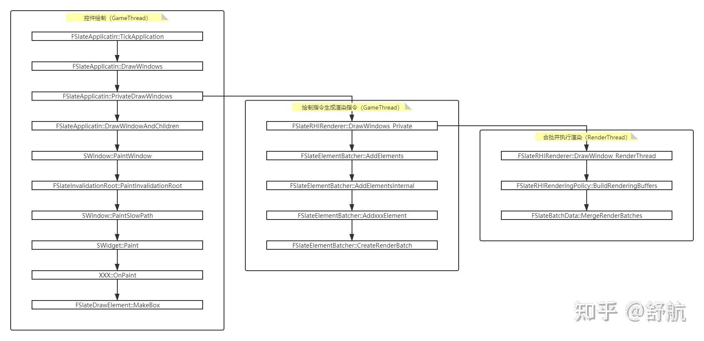

# Slate基础框架
***

<!-- @import "[TOC]" {cmd="toc" depthFrom=1 depthTo=6 orderedList=false} -->

<!-- code_chunk_output -->

- [Slate基础框架](#slate基础框架)
  - [Slate控件分类](#slate控件分类)
  - [Slate渲染流程](#slate渲染流程)
    - [总体流程一瞥](#总体流程一瞥)
    - [图元信息的收集](#图元信息的收集)
  - [Slate是如何布局的](#slate是如何布局的)

<!-- /code_chunk_output -->


通过阅读源码，希望搞明白以下内容：
1. Slate如何渲染的
2. Slate如何布局的
3. Slate合批机制，如何优化性能

## Slate控件分类
***
Slate控件通过槽位(Slot)来实现嵌套，不同的控件类型拥有不同数量的槽位，总体可以分为三种类型：
Slate控件分为三类:
SPanel： 存在多个Slot，支持嵌套多个SWidget
SCompoundWidget：只拥有一个Slot，支持放一个SWidget
SLeafWidget：不存在Slot，是Widget树中的叶子节点。

## Slate渲染流程
*** 
### 总体流程一瞥
可参考文档[Slate合批机制剖析](https://zhuanlan.zhihu.com/p/346275251)

首先我们自己写一个SWidget控件，用断点去看一下整个Slate绘制的调用栈，这里用插件简单起了个Slate面板，插入了我们自定义的控件：
```cpp
return SNew(SDockTab)
    .TabRole(ETabRole::NomadTab)
    [
        // Put your tab content here!
        SNew(SBox)
        .HAlign(HAlign_Center)
        .VAlign(VAlign_Center)
        [
            SNew(SBoxEx)
            .HAlign(HAlign_Center)
            .VAlign(VAlign_Center)
            [
                SNew(SButton)
                .OnClicked(FOnClicked::CreateLambda([]()
                {
                    UE_LOG(LogTemp, Warning, TEXT("AAAAAAAAAAAA"));
                    return FReply::Handled();
                }))
            ]
        ]
	];
```

看下调用栈：


通过调用栈可以大致了解绘制过程：
1. 在FEngineLoop中，每一次循环都会拉起FSlateApplication做Slate的绘制流程
2. 各个SWidget自上而下，通过重载统一的接口OnPaint收集图元信息
3. 收集完一个SWindow所有的图元信息后，在FSlateApplication中完成合批操作，并发送渲染指令给渲染线程

下面是一个简单的示意图：


### 图元信息的收集
在控件的`OnPaint`函数中， 需要提供一个参数`FSlateWindowElementList& OutDrawElements`。这个参数中记录的就是每一个控件的图元信息，它会顺着整根Widget树一路传递下去，最后收集完整根树的图元信息。
我们可以看一个叶子节点SButton来了解一下如何构造图元信息的：
```cpp
int32 SButton::OnPaint(const FPaintArgs& Args, const FGeometry& AllottedGeometry, const FSlateRect& MyCullingRect, FSlateWindowElementList& OutDrawElements, int32 LayerId, const FWidgetStyle& InWidgetStyle, bool bParentEnabled) const
{
	......

	if (BrushResource && BrushResource->DrawAs != ESlateBrushDrawType::NoDrawType)
	{
		FSlateDrawElement::MakeBox(
			OutDrawElements,
			LayerId,
			AllottedGeometry.ToPaintGeometry(),
			BrushResource,
			DrawEffects,
			BrushResource->GetTint(InWidgetStyle) * InWidgetStyle.GetColorAndOpacityTint() * BorderBackgroundColor.Get().GetColor(InWidgetStyle)
		);
	}

	return SCompoundWidget::OnPaint(Args, AllottedGeometry, MyCullingRect, OutDrawElements, LayerId, InWidgetStyle, bEnabled);
}
```

可以看到，SButton通过`FSlateDrawElement::MakeBox`构造了自己的图元信息，并放入`OutDrawElements`中。

在所有Widget的图元信息均收集完毕后，FSlateApplication会将他们都放入一个Buffer中，并调用渲染器执行合批渲染操作：
```cpp
Renderer->DrawWindows( DrawWindowArgs.OutDrawBuffer );
```

## Slate是如何布局的
***
