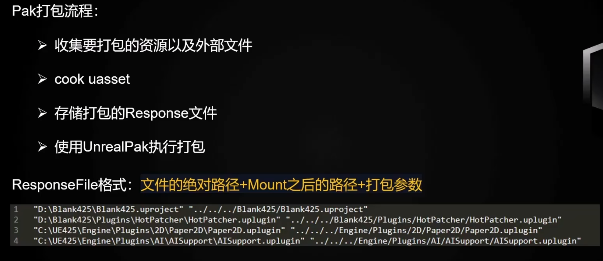

# UE4热更新学习笔记
***
[UE 热更新：需求分析与方案设计](https://imzlp.com/posts/17371/)

## 0. 为什么要热更?
游戏常常会有资源迭代，如果每次迭代资源后都通过打包发布的方式，玩家每次都需要下载包体并手动更新，操作成本非常高。
使用热更新可以支持游戏内替换资源，无需再次打包。

## 1. 哪些资源可以热更?
- 所有经过Cook的文件
- 引擎Slate文件,包括一些基础的UI资源
- 本地化相关资源
- .uproject文件,以及.uplugins文件
- Config相关文件
- Non-Asset相关文件

## 2. 如何热更？
首先需要打出热更资源的Pak包

然后把Pak放入游戏中，默认情况下UE提供了自动挂载Pak的三个模块：
```
# relative to Project Path
Content/Paks/
Saved/Paks/
# relative to Engine Path
Content/Paks
```
把Pak放入这三个目录下，引擎就会自动挂载。