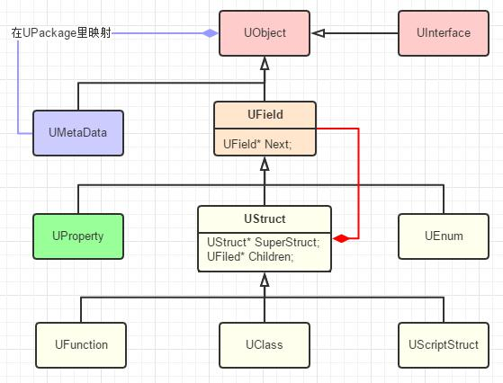
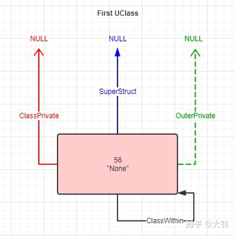
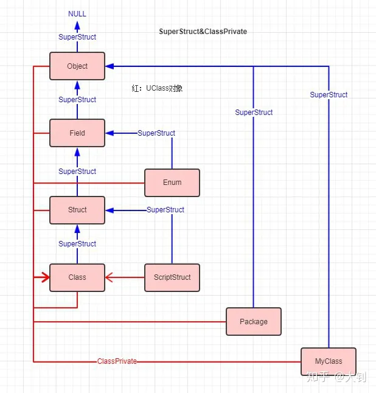
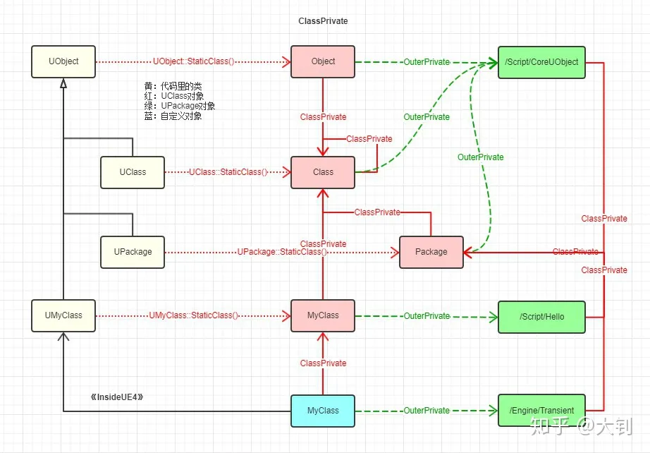

# UE4类型系统学习笔记
***
## 学习目的
使用UE4编程时总会带有一些疑问。比如我们都知道`UPROPERTY()`等宏是为了生成反射信息，但它具体是怎么work的？ 以及`UObject`和`UClass`的关系，`StaticClass`又是什么。
希望可以系统化的梳理一下UE4的类型系统，建立一个游戏引擎类型系统的概念。

学习资料来源于[《InsideUE4》UObject 类型系统概述](https://zhuanlan.zhihu.com/p/22813908)

### 为什么需要类型系统？
UE和其他游戏引擎一样，使用了统一的Object类作为游戏内所有对象的基类。这样可以提供不少好处：
- **万物可追踪：** 一旦所有对象都继承自同一个基类，我们就可以很方便的把所有对象都遍历出来。
- **通用的属性和接口：** Object基类实现的方法在所有对象上都可以使用
- **统一的内存管理机制：** 方便GC追踪、回收分配的内存
- **统一的序列化模型：** 通过反射机制，可以方便的进行序列化
- **为反射提供便利**

既然万物都来源于Object，类型系统呼之欲出，它描述了一个Object对象的类型，提供了一系列该类型的描述，为反射、GC、序列化等功能打下了基础。

### UE如何获取一个类的类型信息？
UE通过用户手动打宏标记的方式，通过文本分析器（UHT）执行静态分析，从而自动生成一系列类型信息。
具体来说，假设我们有一个类UMyObject：
```cpp
#include "CoreMinimal.h"
#include "UObject/Object.h"
#include "MyObject.generated.h"
UCLASS()
class MYPROJECT_API UMyObject : public UObject
{
	GENERATED_BODY()
};

```

通过编译后，UHT会生成`MyObject.generated.h`和`MyObject.gen.cpp`
.generated.h中定义了一系列宏，所以类的头文件中是会包含`MyObject.generated.h`的，使得头文件中的宏（如`UCLASS()`和`GENERATED_BODY()`）能够被展开。

### 类型系统的结构
[《InsideUE4》UObject（三）类型系统设定和结构](https://zhuanlan.zhihu.com/p/24790386)

不要以为类型对象就不属于UObject了，实际上`UClass`、`UFunction`、`UEnum`都属于`UObject`

### UHT生成了什么
UHT的作用，主要是静态分析类、枚举、结构体等，收集UClass关联的属性和方法。这些收集的信息会在后续引擎启动时，注册到一个全局的Map中去，从而构建出特定的UClass对象来。


### 类型信息如何收集
***

#### 第一步：类的Static自动注册
注册一个UClass将会分为多个步骤，最早的一个步骤是通过Static的初始化特性，在程序启动时自动注册。将UHT自动生成的代码展开后，可以发现类中有如下定义：
```cpp
template <typename TClass>
struct TClassCompiledInDefer : public FFieldCompiledInInfo
{
	TClassCompiledInDefer(const TCHAR* InName, SIZE_T InClassSize, uint32 InCrc)
	: FFieldCompiledInInfo(InClassSize, InCrc)
	{
		UClassCompiledInDefer(this, InName, InClassSize, InCrc);
	}
	virtual UClass* Register() const override
	{
		return TClass::StaticClass();
	}
};

static TClassCompiledInDefer<TClass> AutoInitialize##TClass(TEXT(#TClass), sizeof(TClass), TClassCrc); 
```

这个步骤执行完毕后，UE会在一个全局的Array里记录Class的信息，并注册UClass构造函数的指针，但目前并不会实际构造出UClass对象:

```cpp
void UClassCompiledInDefer(FFieldCompiledInInfo* ClassInfo, const TCHAR* Name, SIZE_T ClassSize, uint32 Crc)
{
    //...
    // We will either create a new class or update the static class pointer of the existing one
	GetDeferredClassRegistration().Add(ClassInfo);  //static TArray<FFieldCompiledInInfo*> DeferredClassRegistration;
}
void UObjectCompiledInDefer(UClass *(*InRegister)(), UClass *(*InStaticClass)(), const TCHAR* Name, bool bDynamic, const TCHAR* DynamicPathName, void (*InInitSearchableValues)(TMap<FName, FName>&))
{
    //...
	GetDeferredCompiledInRegistration().Add(InRegister);    //static TArray<class UClass *(*)()> DeferredCompiledInRegistration;
}
```

#### 第二步：Static初始化阶段，注册第一个UClass
UObjct的Class将会成为第一个被注册出来的UClass，因为引擎初始化的过程中，首先会调用到的是`UObject::StaticClass()`

这里说一下`StaticClass()`具体做的事情。之前说过，UHT会为我们写的类自动生成类型信息，而最关键的就是`GENERATED_BODY()`这个宏所展开的信息。

在`GENERATED_BODY()`中，包含一个宏`DECLARE_CLASS`，展开这个宏里面就能看到`StaticClass()`

```cpp
#define DECLARE_CLASS( TClass, TSuperClass, TStaticFlags, TStaticCastFlags, TPackage, TRequiredAPI  ) \
private: \
    TClass& operator=(TClass&&);   \
    TClass& operator=(const TClass&);   \
	TRequiredAPI static UClass* GetPrivateStaticClass(const TCHAR* Package); \
public: \
	/** Bitwise union of #EClassFlags pertaining to this class.*/ \
	enum {StaticClassFlags=TStaticFlags}; \
	/** Typedef for the base class ({{ typedef-type }}) */ \
	typedef TSuperClass Super;\
	/** Typedef for {{ typedef-type }}. */ \
	typedef TClass ThisClass;\
	/** Returns a UClass object representing this class at runtime */ \
	inline static UClass* StaticClass() \
	{ \
		return GetPrivateStaticClass(TPackage); \
	} \
	/** Returns the StaticClassFlags for this class */ \
	inline static EClassCastFlags StaticClassCastFlags() \
	{ \
		return TStaticCastFlags; \
	} \
	DEPRECATED(4.7, "operator new has been deprecated for UObjects - please use NewObject or NewNamedObject instead") \
	inline void* operator new( const size_t InSize, UObject* InOuter=(UObject*)GetTransientPackage(), FName InName=NAME_None, EObjectFlags InSetFlags=RF_NoFlags ) \
	{ \
		return StaticAllocateObject( StaticClass(), InOuter, InName, InSetFlags ); \
	} \
	/** For internal use only; use StaticConstructObject() to create new objects. */ \
	inline void* operator new(const size_t InSize, EInternal InInternalOnly, UObject* InOuter = (UObject*)GetTransientPackage(), FName InName = NAME_None, EObjectFlags InSetFlags = RF_NoFlags) \
	{ \
		return StaticAllocateObject(StaticClass(), InOuter, InName, InSetFlags); \
} \
	/** For internal use only; use StaticConstructObject() to create new objects. */ \
	inline void* operator new( const size_t InSize, EInternal* InMem ) \
	{ \
		return (void*)InMem; \
	}
```

可以看到`StaticClass()`实际上调用了一个内部函数`GetPrivateStaticClass`，这个函数的定义位于UHT生成的`*.gen.cpp`文件中。
该文件下存在一个宏IMPLEMENT_CLASS，里面展开便是GetPrivateStaticClass的具体声明：
```cpp
#define IMPLEMENT_CLASS(TClass, TClassCrc) \
	static TClassCompiledInDefer<TClass> AutoInitialize##TClass(TEXT(#TClass), sizeof(TClass), TClassCrc); \   //延迟注册
	UClass* TClass::GetPrivateStaticClass(const TCHAR* Package) \   //.h里声明的实现，StaticClas()内部就是调用该函数
	{ \
		static UClass* PrivateStaticClass = NULL; \ //又一次static lazy
		if (!PrivateStaticClass) \
		{ \
			/* this could be handled with templates, but we want it external to avoid code bloat */ \
			GetPrivateStaticClassBody( \    //该函数就是真正创建UClass*,以后
				Package, \  //Package名字
				(TCHAR*)TEXT(#TClass) + 1 + ((StaticClassFlags & CLASS_Deprecated) ? 11 : 0), \//类名，+1去掉U、A、F前缀，+11去掉_Deprecated前缀
				PrivateStaticClass, \   //输出引用
				StaticRegisterNatives##TClass, \
				sizeof(TClass), \
				TClass::StaticClassFlags, \
				TClass::StaticClassCastFlags(), \
				TClass::StaticConfigName(), \
				(UClass::ClassConstructorType)InternalConstructor<TClass>, \
				(UClass::ClassVTableHelperCtorCallerType)InternalVTableHelperCtorCaller<TClass>, \
				&TClass::AddReferencedObjects, \
				&TClass::Super::StaticClass, \
				&TClass::WithinClass::StaticClass \
			); \
		} \
		return PrivateStaticClass; \
	}
```

根据上面简述的分析，再回来看到`UObject::StaticClass()`函数。在引擎启动时，第一个注册的类型便是UObject的类型。执行`StaticClass`函数会调用到`GetPrivateStaticClassBody()`函数上去：
```cpp
void GetPrivateStaticClassBody(
    const TCHAR* PackageName,
    const TCHAR* Name,
    UClass*& ReturnClass,
    void(*RegisterNativeFunc)(),
    uint32 InSize,
    EClassFlags InClassFlags,
    EClassCastFlags InClassCastFlags,
    const TCHAR* InConfigName,
    UClass::ClassConstructorType InClassConstructor,
    UClass::ClassVTableHelperCtorCallerType InClassVTableHelperCtorCaller,
    UClass::ClassAddReferencedObjectsType InClassAddReferencedObjects,
    UClass::StaticClassFunctionType InSuperClassFn,
    UClass::StaticClassFunctionType InWithinClassFn,
    bool bIsDynamic /*= false*/
    )
{
    ReturnClass = (UClass*)GUObjectAllocator.AllocateUObject(sizeof(UClass), alignof(UClass), true);//分配内存
    ReturnClass = ::new (ReturnClass)UClass //用placement new在内存上手动调用构造函数
    (
    EC_StaticConstructor,Name,InSize,InClassFlags,InClassCastFlags,InConfigName,
    EObjectFlags(RF_Public | RF_Standalone | RF_Transient | RF_MarkAsNative | RF_MarkAsRootSet),
    InClassConstructor,InClassVTableHelperCtorCaller,InClassAddReferencedObjects
    );
    InitializePrivateStaticClass(InSuperClassFn(),ReturnClass,InWithinClassFn(),PackageName,Name);//初始化UClass*对象
    RegisterNativeFunc();//注册Native函数到UClass中去
}
```
这个函数主要做了以下事情：
1. 分配内存
2. 调用UClass的构造函数
3. 调用`InitializePrivateStaticClass`，会触发`Super::StaticClass()`和`WithinClass::StaticClass()`，加载前置类型
4. 向UClass中添加Native函数

在`InitializePrivateStaticClass`中，主要做了以下事情：
```cpp
COREUOBJECT_API void InitializePrivateStaticClass(
    class UClass* TClass_Super_StaticClass,
    class UClass* TClass_PrivateStaticClass,
    class UClass* TClass_WithinClass_StaticClass,
    const TCHAR* PackageName,
    const TCHAR* Name
    )
{
    //...
    if (TClass_Super_StaticClass != TClass_PrivateStaticClass)
    {
        TClass_PrivateStaticClass->SetSuperStruct(TClass_Super_StaticClass);    //设定类之间的SuperStruct
    }
    else
    {
        TClass_PrivateStaticClass->SetSuperStruct(NULL);    //UObject无基类
    }
    TClass_PrivateStaticClass->ClassWithin = TClass_WithinClass_StaticClass;    //设定Outer类类型
    //...
    TClass_PrivateStaticClass->Register(PackageName, Name); //转到UObjectBase::Register()
    //...
}
```
1. 设定类型的`SuperStruct `，用来指向本类型的基类
2. 设定`ClassWithin`的值。也就是限制Outer的类型
3. 调用`UObjectBase::Register()`，对UClass开始注册

其中，`UObjectBase::Register()`这个操作只是往全局Map中记录了一些UClass的信息，并未做实际操作。因为此时初始化时机过早，还不适合创建各种UProperty、UFunction等。

Static初始化完毕后，将会创造出第一个UClass，也就是UObject的UClass，这个UClass是这样的：

- `SuperStruct = NULL`，因为UObject上面没有基类了

- `ClassPrivate = NULL`，所属的类型，这个时候还没有设置该值。在以后会设置指向`UClass::StaticClass()`，因为其本身是一个UClass。

- `OuterPrivate = NULL`，属于的Outer，也还没放进任何Package里。在以后会设置指向“/Script/CoreUObject”的UPackage。

- `NamePrivate = "None"`，还没有设定任何名字。在以后会设置为“Object”

- `ClassWithin = this`，这个倒是已经知道了指向自己，表明一个UObject可以放在任何UObject下。

- `PropertiesSize = sizeof(UObject) = 56`，所以一个最简单的UObject的大小是56字节。

#### 第三步：FEngineLoop::PreInit阶段，加载CoreUObject
```cpp
int32 FEngineLoop::PreInit(const TCHAR* CmdLine)
{
    //...
    LoadCoreModules();  //加载CoreUObject模块
    //...
    //LoadPreInitModules();   //加载一些PreInit的模块，比如Engine，Renderer
    //...
    AppInit();  //程序初始化
    //...
    ProcessNewlyLoadedUObjects();   //处理最近加载的对象
    //...
    //LoadStartupModules();   //自己写的LoadingPhase为PreDefault的模块在这个时候加载
    //...
    GUObjectArray.CloseDisregardForGC();    //对象池启用，最开始是关闭的
    //...
    //NotifyRegistrationComplete();   //注册完成事件通知，完成Package加载
}
```
在引擎的PreInit阶段，根据dll链接的顺序不同，生成UClass的顺序也不同。当一个新的dll链接进来后，UE通过调用`UClassRegisterAllCompiledInClasses`遍历静态初始化注册进来的类信息，依次对类进行注册操作：
```cpp
void UClassRegisterAllCompiledInClasses()
{
    TArray<FFieldCompiledInInfo*>& DeferredClassRegistration = GetDeferredClassRegistration();
    for (const FFieldCompiledInInfo* Class : DeferredClassRegistration)
    {
        //这里的Class其实是TClassCompiledInDefer<TClass>
        UClass* RegisteredClass = Class->Register();    //return TClass::StaticClass();
    }
    DeferredClassRegistration.Empty();  //前面返回的是引用，因此这里可以清空数据。
}
//...
static TArray<FFieldCompiledInInfo*>& GetDeferredClassRegistration()    //返回可变引用
{
    static TArray<FFieldCompiledInInfo*> DeferredClassRegistration; //单件模式
    return DeferredClassRegistration;
}
```
具体生成UClass的操作，在`Class->Register()`中调用了StaticClass完成的。

#### 第四步：FEngineLoop::AppInit阶段，InitUObject
这一步主要做的操作有：
1. **ProcessNewlyLoadedUObjects回调的注册**，让后续模块加载后可以调用该函数。
2. **对象存储分配系统初始化**：GUObjectAllocator和GUObjectArray初始化。
3. **UObjectProcessRegistrants里对每一项进行注册**，创建Package，设置OuterPrivate，ClassPrivate，NamePrivate，并添加到全局对象数组里。
4. **创建GObjTransientPkg临时包**用来存放以后其他的对象。

这一步之后，类型讲的关系已经被确定，下面是一个类型关系的表：

**SuperStruct**

SuperStruct主要是用在UClass*对象之间表示类型的继承关系。UClass*对象和我们在代码里定义class是一一对应的通过SuperStruct组织形成了一棵类型树。 而对象的类型关系就是通过ClassPrivate来表达的了。

**ClassPrivate**



### 总结
一个UClass*要经历这么几个阶段：

1. **内存构造**。刚创建出来一块白纸一般的内存，简单的调用了UClass的构造函数。UE里一个对象的构造，构造函数的调用只是个起点而已。
注册。给自己一个名字，把自己登记在对象系统中。这步是通过DeferredRegister而不是Register完成的。
2. **对象构造**。往对象里填充属性、函数、接口和元数据的信息。这步我们应该记得是在gen.cpp里的那些函数完成的。
3. **绑定链接**。属性函数都有了，把它们整理整理，尽量优化一下存储结构，为以后的使用提供更高性能和便利。
4. **CDO创建**。既然类型已经有了，那就万事俱备只差国家包分配一个类默认对象了。每个UClass都有一个CDO（Class Default Object），有了CDO，相当于有了一个存档备份和参照，其他对象就心不慌。
5. **引用记号流构建**。一个Class是怎么样有可能引用其他别的对象的，这棵引用树怎么样构建的高效，也是GC中一个非常重要的话题。有了引用记号流，就可以对一个对象高效的分析它引用了其他多少对象。