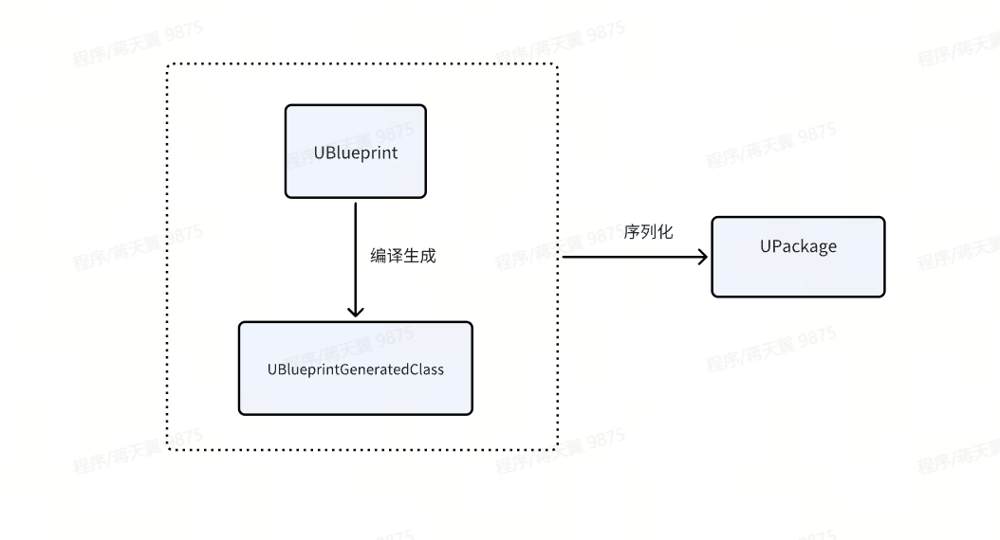

# UE4蓝图简述
## 1. 参考资料
[《UE4 Notes》蓝图虚拟机（BVM）](https://zhuanlan.zhihu.com/p/688017291)
[《UE4 Notes》蓝图 & Lua & C++ 性能对比](https://zhuanlan.zhihu.com/p/689329693)

## 2. 思考：蓝图是什么
生成蓝图对象的方式：
```cpp
	const UClass* BP_SkillObject = LoadClass<USkillObject>(NULL, TEXT("Blueprint'/Game/BluePrints/Combat/Skill/BP_SkillObject.BP_SkillObject_C'"));
	USkillObject* SkillObject = NewObject<USkillObject>(this, BP_SkillObject);
```

尝试在加载对象时，不填写_C
```cpp
	UObject* BPObj = LoadObject<UObject>(this, TEXT("/Game/BluePrints/Char/BP_PlayerCharacter.BP_PlayerCharacter"));
	UObject* BPCObj = LoadObject<UObject>(this, TEXT("/Game/BluePrints/Char/BP_PlayerCharacter.BP_PlayerCharacter_C"));
```


我们加载蓝图类时，都是使用蓝图路径+'_C'的方式加载的，加载出来的是BlueprintGeneratedClass的派生类。

而蓝图对象则是由BlueprintGeneratedClass实例化出来的

**结论：**



蓝图资产uasset -> 蓝图UPackage对象 -> 蓝图UBlueprint对象，当加载路径直接填写蓝图路径时，得到的是蓝图资产所对应的蓝图对象

蓝图生成的对象 -> 由蓝图生成类BP_XXX_C实例化得到。 生成类本身是UClass的派生类，能够用来生成对象。
这也可以解释，为什么加载蓝图类时，必须填写_C（因为只有蓝图生成类可以构造出对象）

**ParentClass、NativeClass的区别：**


## 3. 蓝图与C++的通信
当点击蓝图编译按钮时，UE会收集蓝图中所有信息，并生成UBlueprintGeneratedClass对象。当我们调用蓝图对象身上的方法时，实际上调用的是蓝图生成类身上的一系列UFunction

具体来说，UE会将蓝图中一系列节点编译成一连串的字节码。当执行蓝图方法时，“蓝图虚拟机”会依次解析生成的字节码，并进行对应的操作

在Script.h头文件中有一系列基础的字节码定义，每个字节码都会对应一个具体的函数


### 实践：一个蓝图HelloWorld方法的调用


**1. C++ -> Blueprint**
蓝图的EventBeginPlay节点实际上对应C++中Actor类的`ReceiveBeginPlay`，是一个BlueprintImplementableEvent。这种事件可以在C++中声明，在蓝图中进行相关实现：


在Actor执行BeginPlay函数的末尾，会调用到`ReceiveBeginPlay`从而走到蓝图侧BeginPlay的逻辑：


在编译源代码前，UHT会首先分析文件，为我们生成ReceiveBeginPlay的C++实现。 所有被标记为BlueprintImplementableEvent的UFunction都会生成类似的实现：
```cpp
static FName NAME_AActor_ReceiveBeginPlay = FName(TEXT("ReceiveBeginPlay"));
void AActor::ReceiveBeginPlay()
{
    ProcessEvent(FindFunctionChecked(NAME_AActor_ReceiveBeginPlay),NULL);
}
```
可以看到主要做了两件事：
1. 调用`FindFunctionChecked`查询对象身上名为"NAME_AActor_ReceiveBeginPlay"的方法
2. 调用ProcessEvent执行Ufunction方法

看一下是如何查询到UFunction的：
```cpp
UFunction* UObject::FindFunctionChecked( FName InName ) const
{
	UFunction* Result = FindFunction(InName);
	if (Result == NULL)
	{
		UE_LOG(LogScriptCore, Fatal, TEXT("Failed to find function %s in %s"), *InName.ToString(), *GetFullName());
	}
	return Result;
}

UFunction* UObject::FindFunction( FName InName ) const
{
	return GetClass()->FindFunctionByName(InName);
}
```
可以看出是调用了`GetClass()`去获取了对象对应的UClass，然后查询其身上的UFunction。
对于蓝图对象来说，`GetClass()`返回的便是它的生成类，比如`BP_PlayerCharacter`的生成类`BP_PlayerCharacter_C`

查找得到的UFunction会作为参数，调用`UObject:ProcessEvent()`
`UObject:ProcessEvent()`主要做了两件事：
1. 构建调用栈帧`FFrame`
```cpp
// Create a new local execution stack.
FFrame NewStack(this, Function, Frame, NULL, Function->ChildProperties);
```
- FFrame
FFrame是蓝图虚拟机核心功能的实现，类似函数栈帧，保存了当前蓝图字节码的位置，当前函数节点，以及当前执行该函数的UObject等上下文信息。

>*UFunction* Node*：Invoke的函数节点，当前FFrame的发起者
UObject* Object：当前执行UFunction的UObject
uint8* Code：蓝图字节码
uint8* Locals：蓝图函数参数和局部变量，会在创建FFrame前进行初始化

2. 调用UFunction的Invoke函数，这里有两种情况，如果UFunction对应的是一个Native Function，则直接调用对应C++实现；如果UFunction是一个BlueprintImplementableEvent，则调用`UObject:ProcessInternal`,并最终走到ProcessLocalScriptFunction开始解析蓝图字节码：


解析字节码的核心是FFrame::Step函数，将会循环取下一个字节码执行，直到下一个字节码为`EX_Return`
```cpp
while (*Stack.Code != EX_Return)
{
    ...
    Stack.Step(Stack.Object, Buffer);
}
```

看一下Step的具体实现，非常简洁：
```cpp
void FFrame::Step(UObject* Context, RESULT_DECL)
{
	int32 B = *Code++;
	(GNatives[B])(Context,*this,RESULT_PARAM);
}
```
这里UE维护了一张全局表GNatives，表的Key就是字节码，Value是一个函数指针，蓝图虚拟机解析字节码的方式也就是查表然后调用对应的函数。

- 字节码是如何注册到GNatives里的？
通过`DEFINE_FUNCTION`、`IMPLEMENT_VM_FUNCTION`宏来注册一个字节码到GNatives表中
```cpp
DEFINE_FUNCTION(UObject::execJump)
{
	CHECK_RUNAWAY;

	// Jump immediate.
	CodeSkipSizeType Offset = Stack.ReadCodeSkipCount();
	Stack.Code = &Stack.Node->Script[Offset];
}
IMPLEMENT_VM_FUNCTION( EX_Jump, execJump );
```

通过执行字节码EX_CallMath，最终调用到`PrintString`函数。

至此，一个蓝图方法执行完毕。

### 总结：


## 4. 蓝图编译
