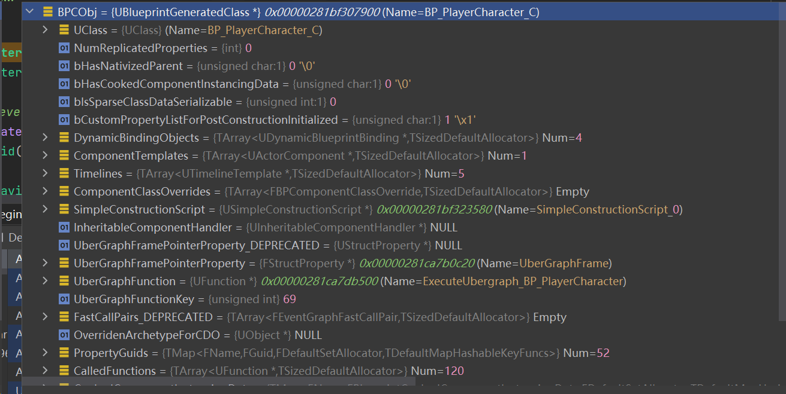

# UE4蓝图简述
## 1. 参考资料
[《UE4 Notes》蓝图虚拟机（BVM）](https://zhuanlan.zhihu.com/p/688017291)
[《UE4 Notes》蓝图 & Lua & C++ 性能对比](https://zhuanlan.zhihu.com/p/689329693)

## 2. 思考：蓝图是什么
生成蓝图对象的方式：
```cpp
	const UClass* BP_SkillObject = LoadClass<USkillObject>(NULL, TEXT("Blueprint'/Game/BluePrints/Combat/Skill/BP_SkillObject.BP_SkillObject_C'"));
	USkillObject* SkillObject = NewObject<USkillObject>(this, BP_SkillObject);
```

尝试在加载对象时，不填写_C
```cpp
	UObject* BPObj = LoadObject<UObject>(this, TEXT("/Game/BluePrints/Char/BP_PlayerCharacter.BP_PlayerCharacter"));
	UObject* BPCObj = LoadObject<UObject>(this, TEXT("/Game/BluePrints/Char/BP_PlayerCharacter.BP_PlayerCharacter_C"));
```


我们加载蓝图类时，都是使用蓝图路径+'_C'的方式加载的，加载出来的是BlueprintGeneratedClass的派生类。
而蓝图对象则是由BlueprintGeneratedClass实例化出来的

**结论：**
蓝图资产uasset -> 蓝图UPackage对象 -> 蓝图UBlueprint对象，当加载路径直接填写蓝图路径时，得到的是蓝图资产所对应的蓝图对象

蓝图生成的对象 -> 由蓝图生成类BP_XXX_C实例化得到。 生成类本身是UClass的派生类，能够用来生成对象。
这也可以解释，为什么加载蓝图类时，必须填写_C（因为只有蓝图生成类可以构造出对象）

