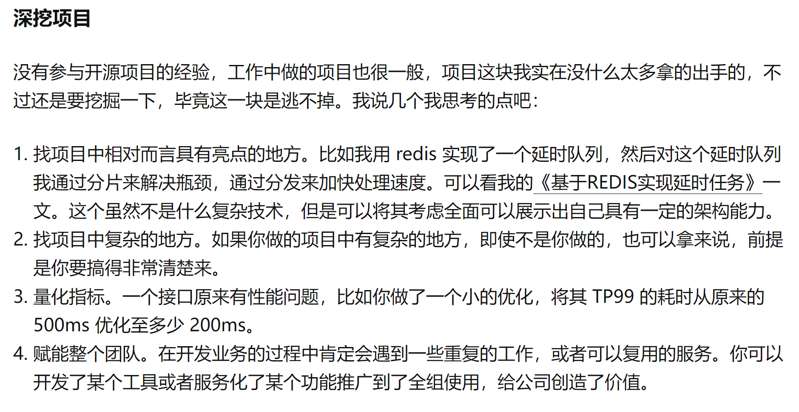
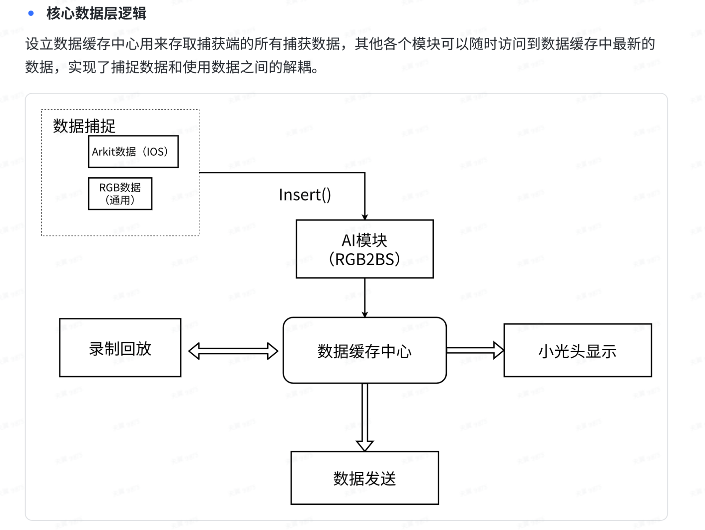

# 简历项目复盘


指导方针：



***
## 1. 面捕APP

### 1.1 整体设计，产品的目标是什么？
目标是以低成本的方式开发一块可高度自定义的面捕软件，支持双端运行。
对于IOS端，在ARkit的基础上支持接入AI同学的增维算法，进一步提升面部细节丰富度；
对于安卓端，接入RGB2BS算法和UVC相机，支持使用USB相机获取RGB图片，通过算法预测bs值，从而替代手机戴头上的笨拙方案。


### 1.2 核心逻辑

所有模块都围绕数据缓存中心进行，耦合度较低。

结合UE的Gameplay框架，核心逻辑的运行如下：
1. 通过自定义Gamemode完成各个模块的初始化，Gamemode中持有各个模块的引用
2. Gamemode中记录当前app状态，当状态发生改变，便会通知各个模块切换运行逻辑
3. 各个模块通过`RegisterTickFunction`的方式来执行Tick

#### 状态驱动
全局维护了面捕软件的三个状态：普通状态、录制状态和回放状态，以此来协调各个模块的联动，执行不同的逻辑。

**具体怎么做到状态驱动的？**
首先使用了UE的`GameplayMessageSubsystem`，一个消息中心，支持通过一系列预定义的`GameplayTag`来监听消息、广播消息。
在Gamemode中，但状态发生改变时，广播这个消息
```cpp
void AJNCaptureMode::ChangeAppState(EAppState State)
{
	UGameplayMessageSubsystem& MessageSubsystem = UGameplayMessageSubsystem::Get(this);
	AppState = State;
	FGameModeEmptyNotifyMessage Msg(State);
	MessageSubsystem.BroadcastMessage(TAG_Change_AppState_Message,Msg);
	UE_LOG(LogJnGameMode,Display,TEXT("JNCaptureMode Change State %d"),State)
}
```

在各个模块中，监听该消息，并注册对应的回调函数。

### 1.3 核心管理模块
在GameMode中对所有管理模块依次做了初始化，各个管理模块以单例方式运行，提供全局访问接口。其中包括几个比较核心的管理模块：

- `FCaptureDataCache` 全局数据缓存中心，各个模块在其中读写数据 
- `UCaptureManager` 负责捕捉数据的采集
- `UTransferManager` 负责面捕数据的传输
- `UPlayBackManager` 负责录制回放
- `UTsViewManager` 负责管理UI界面

### 1.4 全局状态读写
程序运行时需要读取很多配置，比如校准数据、是否开启某些后处理、网络发送的ip等等。
这些配置都存在自定义UObject类的CDO对象中，可以很方便地进行全局读写:
- 使用`GetDefault<...>()`可以拿到只读的CDO对象
- 使用`GetMuteableDefault<...>()`可以拿到读写的CDO对象。

配置类对象支持使用`SaveConfig()`函数将其属性字段序列化到本地文件，实现可持久化读取`（要求UPROPERTY(Config)）`

### 1.5 安卓捕捉模块如何接入SDK，Native代码编写
> 1. 如何接入安卓SDK，比如OpenCV等aar库？

需要在模块中写一个xxx_UPL.xml的文件，里面将aar库引入。

> 2. 如何进行安卓Native开发？

在UPL中有一个GameActivity，可以在里面插入Java代码
```java
<gameActivityClassAdditions>
    <insert>
        public void TestFunc() {
            TestClass.TestFunc();
            nativeTestFunc(3);
        }
        public native void nativeTestFunc(int value);
    </insert>
</gameActivityClassAdditions>
```
插入的Java代码可以通过JNI调用的方式访问到：
- C++调用Java
```cpp
void FAndroidJavaUVCHelper::CheckUVCCameraHelper()
{
	if (JNIEnv* Env = FAndroidApplication::GetJavaEnv())
	{
		bool bIsOptional = false;
		static jmethodID MethonId_TCheckUVCCamera= FJavaWrapper::FindMethod(Env, FJavaWrapper::GameActivityClassID, "initUVCCameraHelper_Android", "()V", bIsOptional);
		FJavaWrapper::CallVoidMethod(Env, FJavaWrapper::GameActivityThis, MethonId_TCheckUVCCamera);
	}
}
```

- Java调用C++
```java
// 从java获取mat
JNI_METHOD void Java_org_opencv_unreal_JNFaceCaptureAndroidHelper_nativeOnUVCFrame(JNIEnv *jenv, jobject thiz, jbyteArray  mat_Addr)
{
	jbyte * olddata =(jbyte*)jenv->GetByteArrayElements(mat_Addr, 0);
	jsize  oldsize =jenv->GetArrayLength(mat_Addr);
	uint8* bytearr = (uint8*)olddata;
	int len = (int)oldsize;

	Mat cv_img = Mat(480,640,CV_8UC3);
	Mat cv_yuv(480 + 480 / 2, 640, CV_8UC1, bytearr);
	cvtColor(cv_yuv,cv_img,COLOR_YUV2BGR_NV21);
	cvtColor(cv_img,cv_img,COLOR_BGR2BGRA);

	MatCache.Enqueue(cv_img);
	CacheNum += 1;

	if (CacheNum > 2 && !MatCache.IsEmpty())
	{
		MatCache.Pop();
		CacheNum -= 1;
	}

	if (!MatCache.IsEmpty())
	{ 
		Mat temp;
		MatCache.Peek(temp);
		
		FAndroidJavaUVCHelper::CameraMatAddress = temp.data;
		FAndroidJavaUVCHelper::MatWidth = 640;
		FAndroidJavaUVCHelper::MatHeight = 480;
		FAndroidJavaUVCHelper::MatChannels = 4;
		FAndroidJavaUVCHelper::IsAvailable = true;
	}
}

```

> 3. 如何解析Java->c++时传递的复杂数据结构？

比如这个方法，Java传递了一个自定义类型的Arraylist：
```cpp
JNI_METHOD void Java_org_opencv_unreal_JNFaceCaptureAndroidHelper_nativeOnCameraOpen
(JNIEnv* jenv, jobject thiz, jobject SupportedSizeList)
```

现在需要解析出`SupportedSizeList`列表中的对象的值。
可以先通过`FindClass`解析出该对象的类型:
```cpp
jclass ListCls = jenv -> FindClass("java/util/ArrayList");
```
拿到类型后，通过`GetMethodId`拿到类型上的方法ID:
```cpp
// 获取ArrayList get()方法的ID
jmethodID list_get = jenv -> GetMethodID(ListCls, "get", "(I)Ljava/lang/Object;");
// 获取ArrayList size()方法的ID
jmethodID list_size = jenv -> GetMethodID(ListCls, "size", "()I");
```
拿到方法ID后，我们就可以对实例对象通过方法ID进行调用了，比如：
```cpp
int ListLen = jenv -> CallIntMethod(SupportedSizeList, list_size);
```
这个可以拿到该列表的长度。

对于列表中的自定义类型，我们也通过`FindClass`拿到对象的具体类型，并通过`GetFieldId`拿到类型中属性的ID
```cpp
// 获取Size对象的Class
jclass SizeCls = jenv -> FindClass("com/serenegiant/usb/Size");
if (SizeCls == NULL)
{
	UE_LOG(LogFAndroidJavaUVCHelper, Error, TEXT("com.serenegiant.usb.Size 没有找到相关类!"));
	return;
}

jfieldID SizeType = jenv -> GetFieldID(SizeCls, "type", "I");
jfieldID SizeWidth = jenv -> GetFieldID(SizeCls, "width", "I");
jfieldID SizeHeight = jenv -> GetFieldID(SizeCls, "height", "I");
jfieldID SizeFps = jenv -> GetFieldID(SizeCls, "fps", "I");
```
后面就为所欲为了，先拿到属性值就用GetxxxField即可
```cpp
for (int i = 0; i < ListLen; i++)
{
	jobject item = jenv -> CallObjectMethod(SupportedSizeList, list_get, i);

	int type = jenv -> GetIntField(item, SizeType);
	int width = jenv -> GetIntField(item, SizeWidth);
	int height = jenv -> GetIntField(item ,SizeHeight);
	int fps = jenv -> GetIntField(item, SizeFps);

	FString TypeName = "NULL";
	...
}
```


### 1.6 录制回放的文件是怎么存储的？
定义回放专属的数据格式，使用UObject自带的序列化进行存储。
`TUniquePtr<FArchive> Ar = TUniquePtr<FArchive>(FileManager->CreateFileWriter(*PakPath));`
```cpp
void UJNUniformDataPak::CustomSerialize(FArchive& Ar)
{
	Ar<<Version;
	Ar<<PakPath;

	int DataNum = 0;// 轨道数量
	FString ClassName;// 用于反射的类名称
	if(Ar.IsSaving())
	{
		DataNum = DataStorage.Num();
		Ar<<DataNum;
		for (auto Data : DataStorage)
		{
			Ar<<Data.Key; // 轨道名字
			
			ClassName = Data.Value->GetClass()->GetName();
			Ar<<ClassName;
			
			Data.Value->CustomSerialize(Ar);
		}

		Ar.Flush();
	}
	if(Ar.IsLoading())
	{
		Ar<<DataNum;
		for(int i = 0; i < DataNum;i++)
		{
			FString Name;
			Ar<<Name;

			// 拿到反射的类名
			Ar<<ClassName;

			UClass* DataClass = FindObject<UClass>(ANY_PACKAGE,*ClassName);
			UObject* Default = DataClass->GetDefaultObject();

			UJNUDDefine_BaseData* baseData = StaticCast<UJNUDDefine_BaseData*>(Default);
			baseData->CustomSerialize(Ar);
			DataStorage.Add(Name,baseData);
		}
	}

	Ar.Close();
}
```

### 1.7 数据传输怎么做的？
分为发送端和接收端，将面捕数据序列化为字节，底层通过FSocket进行数据的传输。

**发送端：** 面捕数据对象重载Serialize接口，使用`FBitWritter`将其序列化为Bit数据。通过FSocket调用`SendData()`发送出去

**接收端：** 使用`FRunableThread`创建一个新的线程，在里面通过`FSocket`循环拉取数据，使用`FBitReader`把数据读出来，反序列化。
之后封装成一个本地LiveLink源，对接动画蓝图。


### 1.8 UI框架MVVM怎么做的？
C++侧定义ViewModel类，类中属性添加Setter标签。对类中属性进行修改后，会广播这个消息。View层监听广播消息，动态刷新自己的UI，达到绑定效果。
目前如果需要View层手动修改VM，也需要调用Set属性方法，这一块是否可以优化？
另外监听到数据改变后，由于不清楚是具体哪个控件发生了改变，所以做的是全局刷新。是否可以监听一个控件ID？（好像是容易实现的）

**优化**
简单看了UE5.1的MVVVMViewModel的实现，发现可以通过`UE::FieldNotification::FFieldMulticastDelegate`来监听类上某个属性的改动。具体做法是Ts侧通过反射拿到类属性ID，然后把Delegate放进去，就实现了VM->V的绑定。
V->VM的绑定，可以通过执行绑定时，缓存住VM的属性名，通过反射找到FieldId，从而修改到VM的值。


### 1.9 打包和自动构建怎么做的？
编译C++ -> 生成ue.d.ts -> 编译ts -> 执行BuildCookRun
打包机Jerkins拉起打包python脚本，通过UAT（Unreal Automaiton tool）进行编译和打包操作。

## 2. Lydia大屏交互工程

### 2.1 动作逻辑如何流畅过度
动画播控整体采用Montage动画而非状态机的模式，原因是需要播放的动画种类很多。
- **Idle动画播放逻辑**：查看当前角色是否有在播放某个动画，如果没有则随机挑选一个Idle动画播放。
- **Idle动画过渡**：在上个动画快播放结束的时候就开始播放下个动画，两个动画播放到两个Slot中，通过一个Alpha值控制权重，达成动画之间的过渡。


### 2.2 异形进度条


## 3. 导播软件工程

### 3.1 导播软件工程整体架构讲述
整体采用多机导播架构，一台ListenServer和多台可水平扩展的Client组成。每台机器有不同的身份，根据自己的身份来决定自己干的事情。

主要的身份有以下几种：
1. **PVW：** 预推流机器，渲染一个高分辨率窗口，时刻准备将画面推流出去。
2. **PGM：** 推流机器，渲染高分辨率窗口，显示实际推流的画面
3. **Preview：** 预览机器，显示24个机位的预览画面，导播可以实时选择将某个预览画面切到PVW上去
4. **1 ~ 4级导播机器：** 分别负责包装、运镜、人物控制、场景控制。
5. **最终推流机器： ** 通过采集卡采集PVW&PGM画面，推流出去（不运行UE）

ListenServer可以充当其中的任意一台，一般交给性能很高的PGM来担任。

同步的策略是，绝大部分管理类Actor由Server端创建，各个客户端通过PlayerController发送RPC请求到服务器。服务器广播RTC告诉指定客户端应该做什么事情。

**多机导播的好处：**
1. 缓解性能压力
2. 操控机Crash不会有很严重的影响
3. 可以分工协作

### 3.2 摇杆相机同步方式
操控端通过PlayerController收集输入指令，RPC调用到服务器上去计算位置。在服务器的Tick中RPC同步位置信息回来。由于服务器的Tick频率可以很高，所以总体来看是丝滑的，若服务器Tick不稳定，则在客户端做预测。具体做法是客户端在没收到RPC调用的之后几帧，使用之前的Transform delta值来位移，保证平滑。

### 3.3 UI框架的设计
UI框架的设计经过了多次迭代，重点讲三个版本：

#### UMG结合纯C++形式
C++侧新建类继承UserWidget，UMG蓝图继承C++类，这样复杂的UI逻辑就可以在C++中编写。
对于游戏内UI，直接用`AddToViewport`即可； 对于编辑器下UI，仿照Plugins中的方式，创建一个SWindow或STab，再调用`UserWidget`身上的方法`GetWidget`拿到其内部`SWidget`，放到Slot中。

**优点**： 缓解了纯蓝图写复杂逻辑的痛苦，且游戏内和编辑器下都可以互通。

**缺点**： C++侧难以拿到Widget蓝图内部的对象，UI事件绑定还得蓝图里连好再转发给C++。其次C++编写无法热重载，出问题直接Crash。对于直播场合，Crash是非常非常致命的问题。


#### PuerTs Mixin形式
编辑器下启动一个虚拟机，使用Mixin特性来给UMG蓝图填充逻辑。需要首先编写UI蓝图对应的Ts脚本，然后UI蓝图继承一个接口，在里面事先填写好Ts脚本的路径。实际显示UI时，会先通过脚本路径做Mixin操作，实现了Ts逻辑的注入。

**优点**: 脚本写逻辑的优点都有了，比如支持热重载，不会crash，写Ts比写C++方便很多。
**缺点**：
1. UI逻辑跑的虚拟机和Runtime下的业务逻辑跑在不同的虚拟机中，导致UI无法直接在Js中找到并调用Runtime下其他对象的方法，很致命。
2. 写起来很麻烦，同时Ts脚本没法给出蓝图组件的自动补全。同时需要依赖脚本文件路径。


#### UI控制器组合模式
首先将Runtime的虚拟机提前到引擎启动时，保证Editor的功能也可以访问到Runtime下。然后使用Ts继承一个UI控制器类，生成一个对应的蓝图类。 UMG蓝图中关联上这个控制器类，在初始化的时候向控制器将自己注册进去。所有UI逻辑，以及UI事件绑定都在控制器中做。

**优点**： 
1. 统一了Editor和Game的逻辑，互相都可以访问到。
2. 由于控制器拿到了Widget的引用，也就知道了Widget的类型，可以在Ts中享受类型的自动补全，写起来很方便。


## 4. PuerTs框架接入&维护
### 4.1 如何实现引擎和脚本的交互的？
三种方式：
1. C++类型Wrap过来，使得Ts可以直接调用或者访问到对象的方法；
2. Ts继承一个引擎类，自动生成一个蓝图，引擎对蓝图的调用会转发到Ts侧；
3. 类似第二种，可以扩展一个引擎蓝图，需要在Ts中提前做注册，可以选择构造出一个新类来。
具体可以参考[PuerTs框架简单梳理](PuerTs框架简单梳理.pdf)


### 4.2 接入后做了哪些修改？
1. Runtime虚拟机提前，兼容Editor下的UI
2. ue.d.ts类型文件生成流程修改，支持自定义导出路径；支持顺带输出一份蓝图的路径信息，方便ts做调用；
3. 加了个CommandLet，支持CI功能
4. 修改了虚拟机部分代码，支持C++侧直接执行一段Js代码

### 4.3 热刷新怎么做的？
[UE4下基于V8实现的代码热刷新](https://zhuanlan.zhihu.com/p/364505146)
V8.Inspector提供了一个`“Debugger.setScriptSource”`命令，通过rpc调用可以实现刷新某个文件代码。
所以只需要本地监听文件变化，RPC调用v8 Inspector命令即可。


### 4.4 调试怎么做的？
V8启动调试服务器，vscode链接上去
