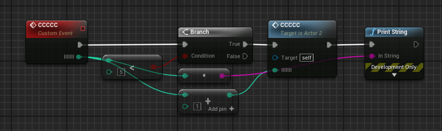
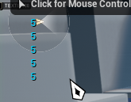
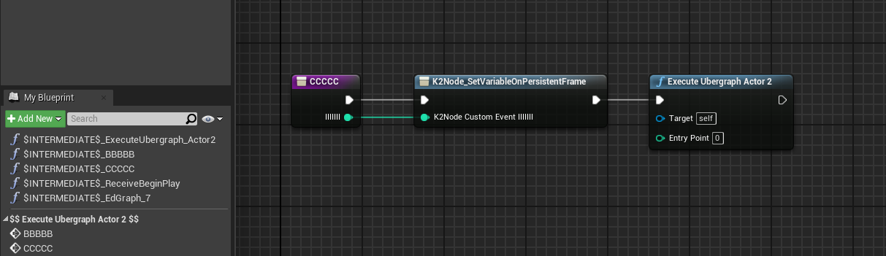

## 问题描述
UE4中，蓝图事件函数在递归调用中会共享参数，比如下面的函数：

执行的打印为：

这显然不符合预期的，我们预期每个函数栈帧中的参数应该都是独立的。事实上，只有蓝图事件函数有这个问题，蓝图函数是没有这个问题的。

## 问题分析
首先，我们查看一下蓝图编译出来的字节码。在DefaultEngine.ini中加两行:
```ini
[Kismet]
CompileDisplaysBinaryBackend=true
```

然后，在蓝图中，左上角File -> Developer -> Save Intermediate Build Products， 保存蓝图编译过程中的中间文件。

可以看到，UE4为我们的蓝图事件函数生成了一个蓝图函数，它首先执行了K2Node_SetVariableOnPersistentFrame，然后调用蓝UberGraph函数。
在UE中，所有蓝图事件函数最终都会被打包成一个UberGraph函数，对蓝图事件函数的调用，最终都会转化为对UberGraph函数的调用，通过字节码跳转来定位到需要执行的逻辑位置。 现在我们看看调用这个CCCCC函数，字节码是怎么样的：
```
[0131.08][378]LogK2Compiler: [function CCCCC]:
[0131.08][378]Label_0x3:
[0131.08][378]     $64: LetValueOnPersistentFrame
[0131.08][378]       Destination variable: K2Node_CustomEvent_IIIIIII, offset: 4
[0131.08][378]       Expression:
[0131.08][378]         $0: Local variable named IIIIIII
[0131.09][378]Label_0x17:
[0131.09][378]     $46: Local Final Script Function (stack node Actor2_C::ExecuteUbergraph_Actor2)
[0131.09][378]       $1D: literal int32 43
[0131.09][378]       $16: EX_EndFunctionParms
[0131.09][378]Label_0x27:
[0131.09][378]     $4: Return expression
[0131.09][378]       $B: EX_Nothing
[0131.09][378]Label_0x29:
[0131.09][378]     $53: EX_EndOfScript
```
可以看到，和蓝图里看到的类似，最后会执行到一个Local Final Script Function， 调用ExecuteUbergraph_Actor2， 这就是走到蓝图事件函数的逻辑了

我们再看看CCCCC函数中，PrintString的参数是怎么获得的：
```
[0131.07][378]     $F: Let (Variable = Expression)
[0131.07][378]       Variable:
[0131.07][378]         $0: Local variable named CallFunc_Conv_IntToString_ReturnValue
[0131.07][378]       Expression:
[0131.07][378]         $68: Call Math (stack node KismetStringLibrary::Conv_IntToString)
[0131.07][378]           $0: Local variable named K2Node_CustomEvent_IIIIIII
[0131.07][378]           $16: EX_EndFunctionParms
[0131.07][378]Label_0xC8:
[0131.07][378]     $5E: .. debug site ..
[0131.07][378]Label_0xC9:
[0131.07][378]     $68: Call Math (stack node KismetSystemLibrary::PrintString)
[0131.07][378]       $17: EX_Self
[0131.07][378]       $0: Local variable named CallFunc_Conv_IntToString_ReturnValue
[0131.07][378]       $27: EX_True
[0131.07][378]       $27: EX_True
[0131.07][378]       $2F: literal struct LinearColor (serialized size: 16)
[0131.07][378]         $1E: literal float 0.000000
[0131.07][378]         $1E: literal float 0.660000
[0131.07][378]         $1E: literal float 1.000000
[0131.07][378]         $1E: literal float 1.000000
[0131.07][378]         $30: EX_EndStructConst
[0131.07][378]       $1E: literal float 2.000000
[0131.07][378]       $16: EX_EndFunctionParms
```
可以看到PrintString的参数是CallFunc_Conv_IntToString_ReturnValue，这是蓝图中IntToString节点的返回值。 我们再看IntToString节点的参数：
```
[0131.07][378]       Expression:
[0131.07][378]         $68: Call Math (stack node KismetStringLibrary::Conv_IntToString)
[0131.07][378]           $0: Local variable named K2Node_CustomEvent_IIIIIII
[0131.07][378]           $16: EX_EndFunctionParms
```
是K2Node_CustomEvent_IIIIIII，而这个值就是前面提到的，在调用UberGraph函数之前K2Node_SetVariableOnPersistentFrame节点设置的。 

总结：蓝图事件中的参数都共享一个固定的地址。在调用蓝图事件函数之前，会把所有参数写入到这些固定地址中。

## 解决方案
我们需要在蓝图事件调用时，写入参数地址之前，将参数地址的值先保存下来。在蓝图事件调用之后，将参数的值再恢复：
### 保存参数原本的值
```cpp
DEFINE_FUNCTION(UObject::execLetValueOnPersistentFrame)
{
#if USE_UBER_GRAPH_PERSISTENT_FRAME
    Stack.MostRecentProperty        = NULL;
    Stack.MostRecentPropertyAddress = NULL;

    FProperty* DestProperty         = Stack.ReadProperty();
    checkSlow(DestProperty);
    UFunction* UberGraphFunction = CastChecked<UFunction>(DestProperty->GetOwnerStruct());
    checkSlow(Stack.Object->GetClass()->IsChildOf(UberGraphFunction->GetOuterUClassUnchecked()));
    uint8* FrameBase = UberGraphFunction->GetOuterUClassUnchecked()->GetPersistentUberGraphFrame(Stack.Object, UberGraphFunction);
    checkSlow(FrameBase);
    uint8* DestAddress = DestProperty->ContainerPtrToValuePtr<uint8>(FrameBase);

    // 提前保存地址内的值
	if (UberGraphFunction->GetOuterUClassUnchecked()->SupportSavePersistentUberGraphFrameProperties())
	{
		UberGraphFunction->GetOuterUClassUnchecked()->PushPersistentUberGraphFrameProperties(FrameBase, DestProperty, &Stack);
	}

    Stack.Step(Stack.Object, DestAddress);

#else
    checkf(false, TEXT("execLetValueOnPersistentFrame: UberGraphPersistentFrame is not supported by current build!"));
#endif
}
```

### 恢复参数原本的值
在一个蓝图事件函数执行完毕后，我们将值恢复。 蓝图事件函数的执行是`ProcessScriptFunction`，我们在里面插入恢复值的逻辑
```cpp
void ProcessScriptFunction(UObject* Context, UFunction* Function, FFrame& Stack, RESULT_DECL, Exec ExecFtor)
{
    check(!Function->HasAnyFunctionFlags(FUNC_Native));

    // Allocate any temporary memory the script may need via AllocA. This AllocA dependency, along with
    // the desire to inline calls to our Execution function are the reason for this template function:
    uint8* FrameMemory = nullptr;

    // ......

    if (Function->Script.Num() > 0)
    {
        // Execute the code.
        ExecFtor(Context, NewStack, RESULT_PARAM);
    }

    // 在ExecFtor后，蓝图函数的逻辑已经执行完毕，可以在这里恢复参数值

#if USE_UBER_GRAPH_PERSISTENT_FRAME
    Function->GetOuterUClassUnchecked()->PopPersistentUberGraphFrameProperties(FrameMemory, &Stack);
#endif

    // ......
}
```